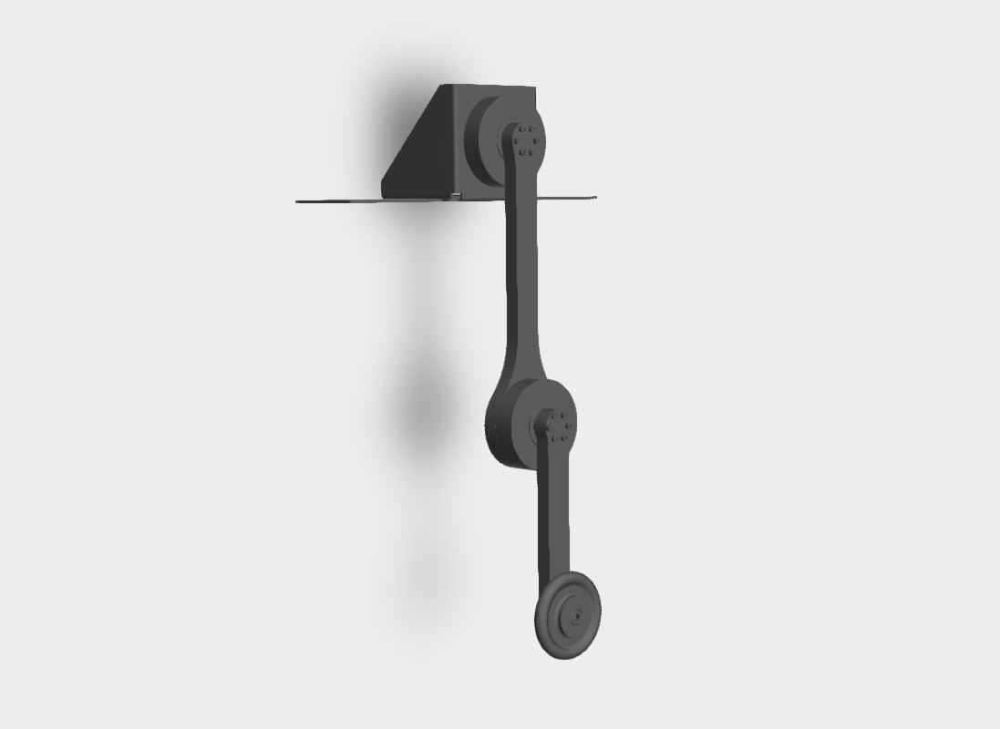
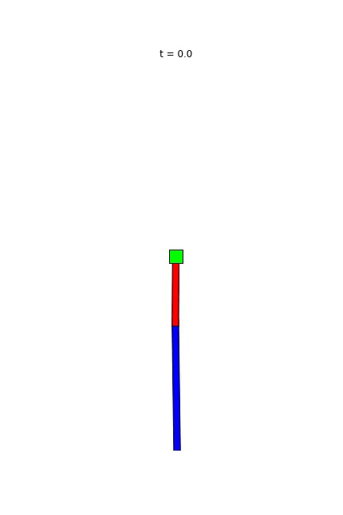

# Dual Purpose Acrobot & Pendubot Platform 

## Introduction #
This project offers an open-source and low-cost kit to test control algorithms for underactuated robots with strongly non-linear dynamics. It implements a **double pendulum** platform built using two quasi-direct drive actuators (QDDs). Due to low friction and high mechanical transparency offered by QDDs, one of the actuators can be kept passive and be used as an encoder. When the shoulder motor is passive and elbow motor is active, the system serves as an **acrobot** and when the shoulder is active and elbow is passive, the system serves as a **pendubot** setup. This project describes the _offline_ and _online_ control methods which can be studied using this dual purpose kit, lists its components, discusses best practices for implementation, presents results from experiments with the simulator and the real system. This repository describes the hardware (CAD, Bill Of Materials (BOM) etc.) required to build the physical system and provides the software (URDF models, simulation and controller) to control it.

## Authors #

* [Shivesh Kumar](https://robotik.dfki-bremen.de/en/about-us/staff/shku02.html) (Project Supervisor)
* [Felix Wiebe](https://robotik.dfki-bremen.de/en/about-us/staff/fewi01.html) (Software Maintainer)
* [Mahdi Javadi](https://robotik.dfki-bremen.de/en/about-us/staff/maja04/) (Hardware Maintainer)
* [Jonathan Babel](https://robotik.dfki-bremen.de/en/about-us/staff/joba02.html) 
* [Lasse Maywald](https://robotik.dfki-bremen.de/en/about-us/staff/lama02/)
* [Heiner Peters](https://robotik.dfki-bremen.de/en/about-us/staff/hepe02.html)
* [Shubham Vyas](https://robotik.dfki-bremen.de/en/about-us/staff/shvy01/)
* [Melya Boukheddimi](https://robotik.dfki-bremen.de/en/about-us/staff/mebo01/)

Feel free to contact us if you have questions about the test bench. Enjoy!

## Contributing

1. Fork it (<https://github.com/yourname/yourproject/fork>)
2. Create your feature branch (`git checkout -b feature/fooBar`)
3. Commit your changes (`git commit -am 'Add some fooBar'`)
4. Push to the branch (`git push origin feature/fooBar`)
5. Create a new Pull Request

See [Contributing](CONTRIBUTING.md) for more details.

## Safety Notes #

When working with a real system be careful and mind the following safety measures:

* Brushless motors can be very powerful, moving with tremendous force and speed. Always limit the range of motion, power, force and speed using configurable parameters, current limited supplies, and mechanical design.

* Stay away from the plane in which double pendulum is swinging. It is recommended to have a safety cage surrounding the double pendulum in case the pendulum flies away.

* Make sure you have access to emergency stop while doing experiments. Be extra careful while operating in pure torque control loop.

## Acknowledgements #
This work has been performed in the M-RoCK project funded by the German Aerospace Center (DLR) with federal funds (Grant Number: FKZ 01IW21002) from the Federal Ministry of Education and Research (BMBF) and is additionally supported with project funds from the federal state of Bremen for setting up the Underactuated Robotics Lab (Grant Number: 201-001-10-3/2021-3-2).

## License

This work has been released under the BSD 3-Clause License. Details and terms of use are specified in the LICENSE file within this repository. Note that we do not publish third-party software, hence software packages from other developers are released under their very own terms and conditions. If you install third-party software packages along with this repo ensure  that you follow each individual license agreement.   

### Repository Overview

| Controller/Method     | Simulation Success (acrobot)   | Simulation Success (pendubot)   | Tested on real acrobot |   Migrated    |
|:----------------------|:------------------------------:|:-------------------------------:|:----------------------:|:-------------:|
|LQR (dependency free)  |yes                             |yes                              |                        |yes            |
|LQR (drake)            |yes                             |yes                              |                        |no             |
|Partial feedback lin   |yes                             |no                               |no                      |yes            |
|Direct Col. (drake)    |yes                             |yes                              |yes (failed with tvlqr) |no             |
|TVLQR (drake)          |yes                             |yes                              |yes (failed with dc traj)|no            |
|iLQR (drake )          |no                              |no                               |no                      |no             |
|iLQR (c++)             |no                              |no                               |no                      |no             |
|DDP (crocoddyl)        |yes                             |yes                              |no                      |no             |

|Other                                  | Implemented   | Migrated  |
|:--------------------------------------|:-------------:|:---------:|
|Plant + Simulator (python)             |yes            |yes        |
|Plant + Simulator (c++)                |yes            |no         |
|System Identification                  |yes            |no         |
|LQR Region of Attraction               |yes            |no         |
|Design Optimization                    |no             |no         |
|Parameter Optimization with CMA-ES     |yes            |yes        |
|Controller Benchmark Tool              |no             |no         |
|Hardware specification/documentation   |no             |no         |

# Todos
- Autodesk A360
    - Get a CAD from Heiner, get a link from the website and put it in repository
- Cleanup
    - An **Example folder** for test and simulation
    - **data folder** for the results and data of the system
- Software
    - Double pendulum 
        - Trajectory optimization
        - TVLQR
        - LQR
    - Design optimization
    - **unit test** folder

- Documentation
- Tests
