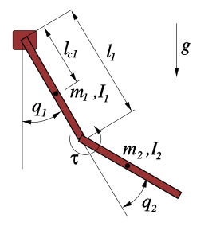

<div align="center">

#  Double Pendulum
</div>


### Equation of Motion


```math
\small{\begin{gather*} (I_1 + I_2 + m_2 l_1^2 +
      2m_2 l_1 l_{c2} c_2) \ddot{q}_1 + (I_2 + m_2 l_1 l_{c2} c_2)\ddot{q}_2 -
      2m_2 l_1 l_{c2} s_2 \dot{q}_1 \dot{q}_2 \\ \quad -m_2 l_1 l_{c2} s_2
      \dot{q}_2^2 + m_1 g l_{c1}s_1 + m_2 g (l_1 s_1 + l_{c2} s_{1+2}) = \tau_1 \\
      (I_2 + m_2 l_1 l_{c2} c_2) \ddot{q}_1 + I_2 \ddot{q}_2 + m_2 l_1 l_{c2}
      s_2 \dot{q}_1^2 + m_2 g l_{c2} s_{1+2} = \tau_2 \end{gather*}}
```



where

- $`\small{(q_1,q_2)}`$, $`\small{(\dot{q_1},\dot{q_2})}`$, $`\small{(\ddot{q_1},\ddot{q_2})}`$ are the angular displacements, angular velocities and angular accelerations of the double pendulum. $`\small{q_1=q_2=0}`$ means the pendulum is at its stable fixpoint (i.e. hanging down).
- $`\small{I_1, I_2}`$ are the inertia of the each link. For a point mass in general: $`\small{I=ml^2}`$
- $`\small{m}`$ mass of the pendulum
- $`\small{l}`$ length of the pendulum
- $`\small{b}`$ damping friction coefficient
- $`\small{c_f}`$ coulomb friction coefficient
- $`\small{g}`$ gravity (positive direction points down)
- $`\small{\tau_1,\tau_2}`$ torques applied by the motors. Depending on the actuation of the joints, the following systems can be acchieved:
- $`\small{\tau_1,\tau_2} \Rightarrow \quad`$ **double pendulum**
- $`\small{\tau_1} \,\,\quad \Rightarrow \quad`$ **Pendubot**
- $`\small{\tau_2}\,\,\quad \Rightarrow \quad`$  **acrobot**
The double pendulum has two fixpoints, one of them being stable (hanging down configuration, i.e. $`\small{q_1=q_2=0}`$) and the other being unstable (pointing upwards, i.e. $`\small{q_1=\pi,q_2=0}`$). A challenge from the control point of view is to swing the system to the unstable fixpoint and stabilize it in that state.

### Energy of the Pendulum
--------------------------------------------------------------------

* Kinetic Energy (K) = 

```math
\small{\begin{gather*} 
\quad K_1 = \frac{1}{2} I_1 \dot{q}_1^2
      \\ K_2 = \frac{1}{2} ( m_2 l_1^2 + I_2 + 2 m_2 l_1 l_{c2} c_2 )
      \dot{q}_1^2 + \frac{1}{2} I_2 \dot{q}_2^2 + (I_2 + m_2 l_1 l_{c2} c_2)
      \dot{q}_1 \dot{q}_2 \\\end{gather*}}
```
* Potential Energy (U) 
```math
\small{\begin{align*}
       U = -m_1 g l_{c1} c_1 - m_2 g (l_1 c_1 +
      l_{c2} c_{1+2})
      \end{align*}}
```
* Total Energy (E) 
```math 
\small{\begin{align*}
E = K_1 + K_2 + U
      \end{align*}}
```

<br/>
