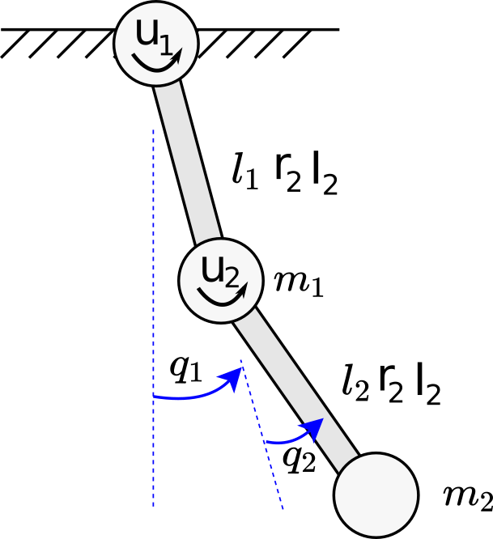

The Double Pendulum System
==========================

This page gives an overview over the mathematical desciption of the double
pendulum dynamics.

Equation of Motion
~~~~~~~~~~~~~~~~~~

.. math::

      \newcommand{\vect}[1]{\boldsymbol{#1}}
      \newcommand{\dvect}[1]{\dot{\boldsymbol{#1}}}
      \newcommand{\ddvect}[1]{\ddot{\boldsymbol{#1}}}
      \newcommand{\mat}[1]{\boldsymbol{#1}}

We model the dynamics  of the double pendulum with 15 parameters which include
8 link parameters namely masses :math:`(m_1, m_2)`, lengths :math:`(l_1, l_2)`, center of
masses :math:`(r_1, r_2)`, inertias :math:`(I_1, I_2)` for the two links, and 6 actuator
parameters namely motor inertia :math:`I_r`, gear ratio :math:`g_r`, coulomb friction
:math:`(c_{f1}, c_{f2})`, viscous friction :math:`(b_1, b_2)` for the two
joints and gravity :math:`g`.

The generalized coordinates :math:`\vect{q} = (q_1, q_2)^T` are the joint angles
measured from the free hanging position.
The state vector of the system contains the coordinates and their time
derivatives: :math:`\vect{x} = (\vect{q}, \dvect{q})^T`. The torques applied by the
actuators are :math:`\vect{u} = (u_1, u_2)`.  The equations of motion for the
dynamics of a dynamical system can be written as

.. math::

      \dvect{x} &= \vect{f}(\vect{x}, \vect{u}) \label{eq:dyn}\\
      % \left[ \begin{matrix}
      %     \dvect{q} \\
      %     \ddvect{q}
      % \end{matrix} \right]
      &=
      \left[ \begin{matrix}
          \dvect{q} \\
          \mat{M}^{-1}(\mat{D} \vect{u} - \mat{C}(\vect{q}, \dot{\vect{q}}) \dot{\vect{q}} +
  \mat{G}(\vect{q}) - \mat{F}(\dot{\vect{q}})) \label{eq:dyn2}
      \end{matrix} \right]

The equation in the bottom half of the vector is also known as manipulator equation.
For the double pendulum, the entities in the manipulator
equation are the mass matrix
(with :math:`s_1 = \sin(q_1), c_1 = \cos(q_1), \ldots`)

.. math::

  \mat{M} =
  \left[ {\begin{array}{cc}
  I_1 + I_2 + l_1^2m_2 + 2l_1m_2r_2c_2 + g_r^2I_r + I_r  &   I_2 + l_1m_2r_2c_2 - g_rI_r  \\
  I_2 + l_1m_2r_2c_2 - g_rI_r                    & I_2 + g_r^2I_r                       \\
  \end{array}} \right],

the Coriolis matrix

.. math::
    \mat{C} =
    \left[\begin{matrix}
    - 2 \dot{q}_2 l_{1} m_{2} r_{2} s_2 & - \dot{q}_2 l_{1} m_{2} r_{2} s_2\\
    \dot{q}_1 l_{1} m_{2} r_{2} s_2 &   0
    \end{matrix}\right],
    \label{eq:coriolis_matrix}
the gravity vector

.. math::
    \mat{G} =
    \left[\begin{matrix}
    - g m_{1} r_{1} s_1 - g m_{2} \left(l_{1}
    s_1 + r_{2} s_{1+2} \right)\\
        - g m_{2} r_{2} s_{1+2}
        \end{matrix}\right],
        \label{eq:gravity_matrix}

the friction vector

.. math::
    \mat{F} =
    \left[\begin{matrix}
        %b_1 \dot{q_1} + c_{f1} \text{sign}(\dot{q_1}) \\
        %b_2 \dot{q_1} + c_{f2} \text{sign}(\dot{q_2})
        b_1 \dot{q_1} + c_{f1} \arctan(100\,\dot{q_1}) \\
        b_2 \dot{q_1} + c_{f2} \arctan(100\,\dot{q_2})
    \end{matrix} \right]
    \label{eq:friction_matrix}

and the actuator selection matrix :math:`\mat {D}`

.. math::
    \mat{D}_{full} =
    \left[\begin{matrix}
    1 & 0 \\ 0 & 1
    \end{matrix} \right],
     \quad
    \mat{D}_{pendu} =
    \left[\begin{matrix}
    1 & 0 \\ 0 & 0
    \end{matrix} \right],
     \quad
    \mat{D}_{acro} =
    \left[\begin{matrix}
    0 & 0 \\ 0 & 1
    \end{matrix} \right]

for the fully actuated system, the pendubot or the acrobot.

### Energy of the Pendulum
--------------------------

-  Kinetic Energy
.. math::

    E_{kin} = \dot{\vect{q}}^T \mat{M} \dot{\vect{q}}

-  Potential Energy
.. math::

       E_{pot} = - m_1 g r_1 c_1 - m_2 g (l_1 c_1 + r_2 c_{1+2}).

-  Total Energy
.. math::

       E = E_{kin} + E_{pot}

