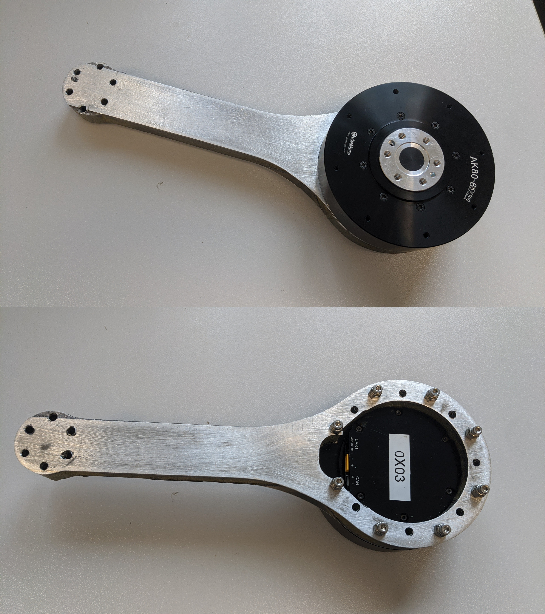
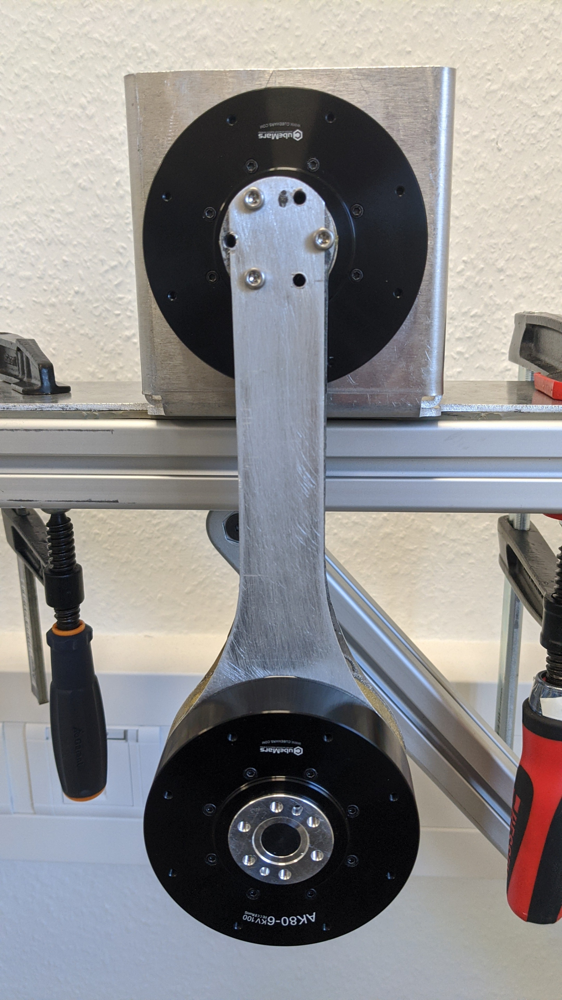
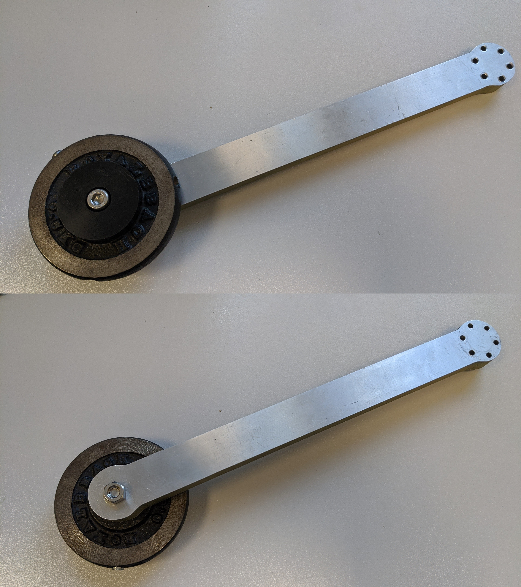

Hardware Assembly
=================

For assembling the hardware follow these steps:

1. For the physical assembly of the double pendulum start by mounting the motor
   mount on a robust horizontal surface (e.g a table). If suffices to fix the
   motor mount with one or two screw clamps. Make sure that the swinging plane
   of the double pendulum is free. Mount the first motor to the motor mount.
2. Mount the second motor to the end of the first link.
3. Attach the first link to the mounted motor (to the motor shaft).
4. Attach the weight fixation to the weight.
5. Attach the weight to the end of the second link.
6. Mount the second link to the second motor shaft.

.. |im_step1| image:: ../figures/assembly_steps/step1_hardware_assembly_mount_motor1.jpg

.. |im_step4| image:: ../figures/assembly_steps/step4_hardware_assembly_weightfixation.jpg

.. |im_step6| image:: ../figures/assembly_steps/step6_hardware_assembly_link2_motor2.jpg

+------------+------------+------------+
| |im_step1| | |im_step2| | |im_step3| |
+------------+------------+------------+
| Step 1     | Step 2     | Step 3     |
+------------+------------+------------+
| |im_step4| | |im_step5| | |im_step6| |
+------------+------------+------------+
| Step 4     | Step 5     | Step 6     |
+------------+------------+------------+

.. note::

   Since the motors do not offer a hollow shaft, the cables (power and can) to
   the second motor need to come from the front.

.. note::

   If the second link is longer than the first link, the first link needs to be
   extended in the opposite direction with a U-shaped aluminium piece to
   prevent windup of cables. The U-shape is attached between the first motor
   and the first link.

.. note::

   If the width of the weight does not allow an inward facing position (as in
   figure (f)) because it would collide with the first link, the weight can
   also be mounted facing outside.
   
