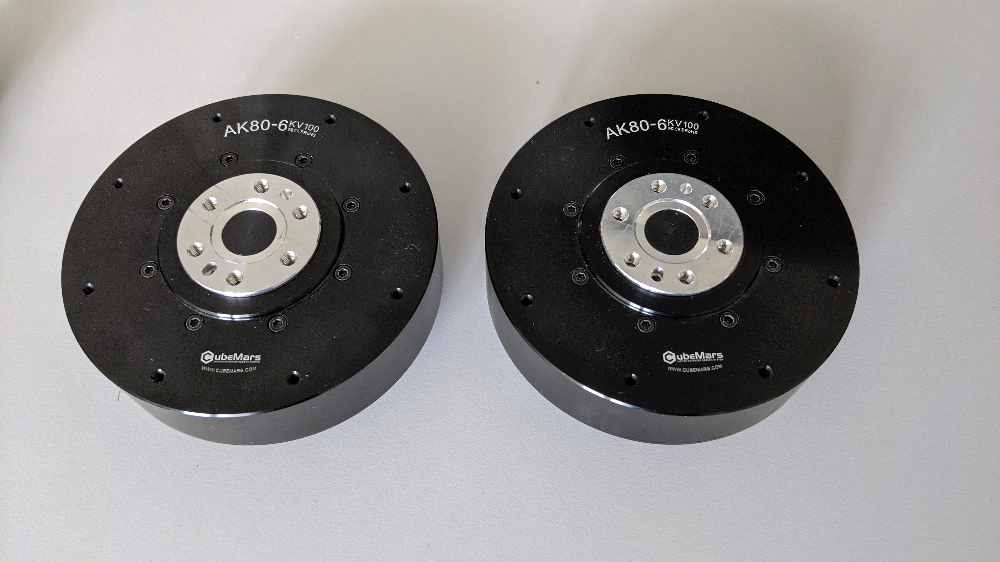
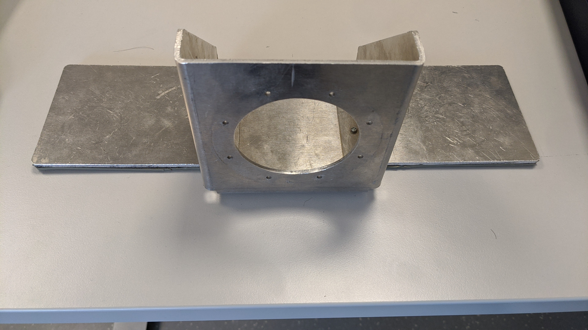
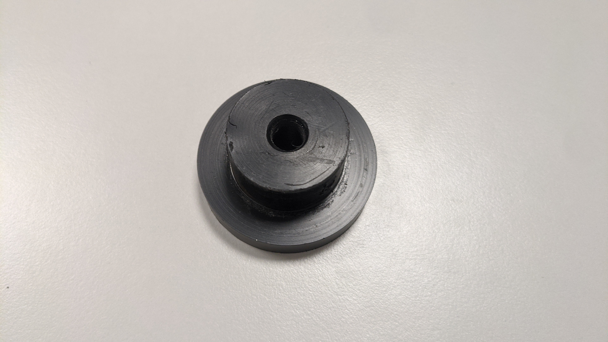
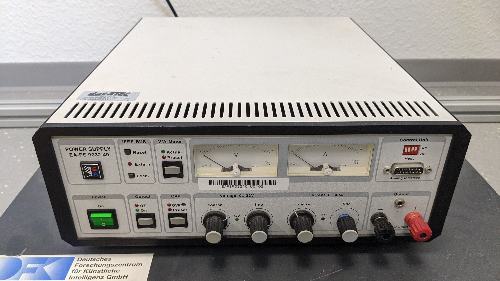
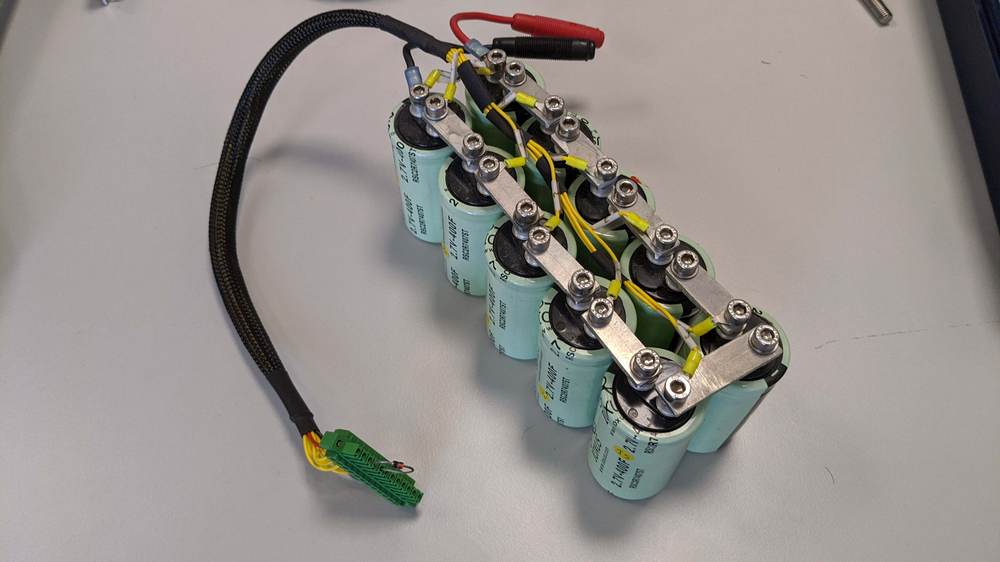
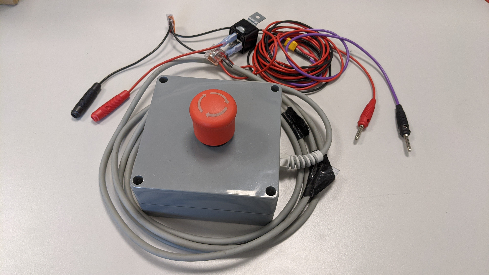
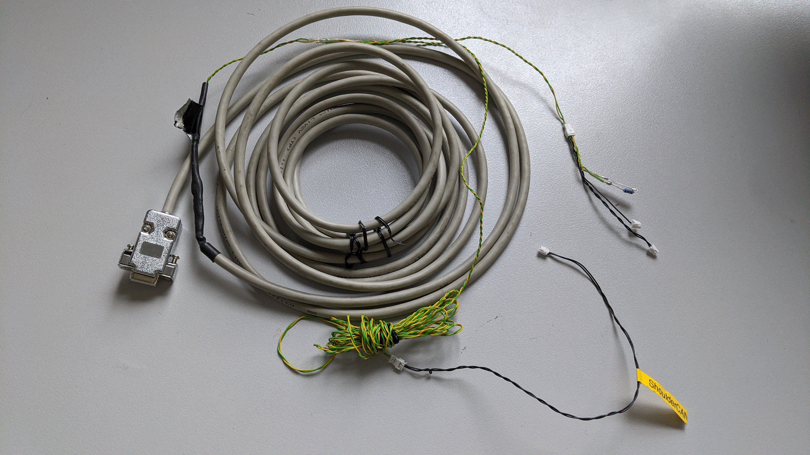
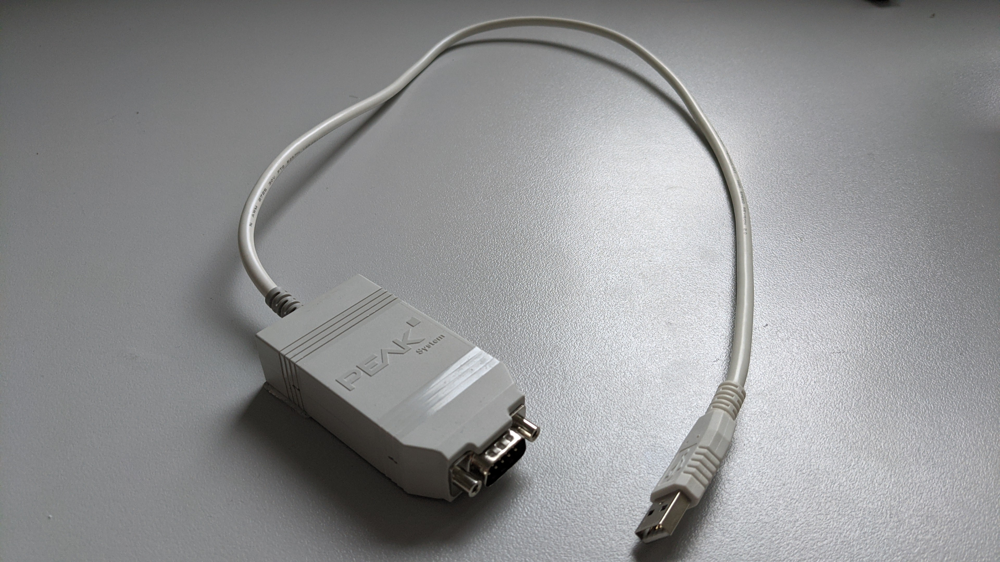
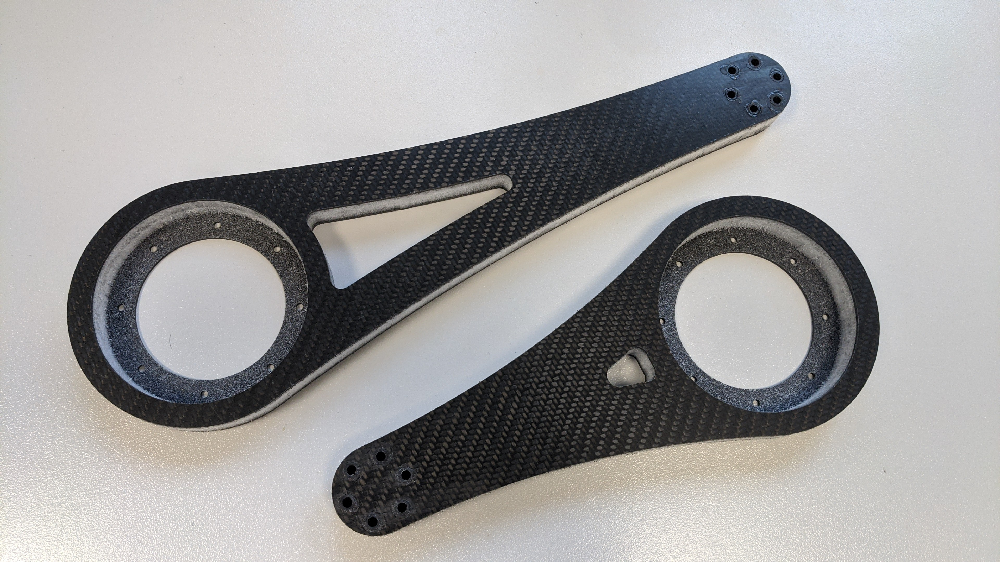

Bill of Materials
=================

The hardware setup is build from the following components:

.. csv-table::
    :header: "Material", "Quantity"

    "t-motor AK80-6",                                   "2"
    "Motor mount (folded aluminum sheet metal)",        "1"
    "20 cm/30 cm link (Airex or carbon)",               "1"
    "30 cm/20 cm link (Airex or carbon)",               "1"
    "0.5 kg weight ",                                   "1"
    "Weight fixation (lathed POM)  ",                   "1"
    "Power supply ",                                    "1"
    "Capacitor ",                                       "1"
    "Power cable ",                                     "2"
    "Emergency switch ",                                "1"
    "CAN cable ",                                       "1"
    "USB-to-CAN interface ",                            "1"
    "Aluminum U shape ",                                "1"
    "Screw M10x45 ",                                    "1"
    "Hexagonal nut M10 ",                               "1"
    "Screw M5x40 ",                                     "1"
    "Screw M4x20 ",                                     "12"
    "Screw M3x20 ",                                     "8"
    "Screw M3x6 ",                                      "8"

.. |im_links| image:: ../figures/hardware_parts/hardware_parts_c_links_foam.jpg

.. |im_weight| image:: ../figures/hardware_parts/hardware_parts_d_weight.jpg

.. |im_powercable| image:: ../figures/hardware_parts/hardware_parts_h_powercable.jpg

.. |im_ushape| image:: ../figures/hardware_parts/hardware_parts_l_aluminumUshape.jpg

+-----------------------+-------------------+--------------------------+----------------------+
| |im_motors|           | |im_motormount|   | |im_links|               | |im_weight|          |
+-----------------------+-------------------+--------------------------+----------------------+
| Motors                | Motor mount       | Links                    | Weight               |
+-----------------------+-------------------+--------------------------+----------------------+
| |im_weightfixation|   | |im_powersupply|  | |im_capacitor|           | |im_powercable|      |
+-----------------------+-------------------+--------------------------+----------------------+
| Weight fixation       | Power supply      | Capacitor                | Power cable          |
+-----------------------+-------------------+--------------------------+----------------------+
| |im_emergencyswitch|  | |im_cancable|     | |im_links|               | |im_ushape|          |
+-----------------------+-------------------+--------------------------+----------------------+
| Emergency switch      | CAN cable         | USB-to-CAN interface     | Aluminum U shape     |
+-----------------------+-------------------+--------------------------+----------------------+

Links
~~~~~

The double pendulum has been assembled with different link types in the past.
In the beginning the links where made of PVC rigid foam (Airex) and aluminum 
sheets for stabilization. Later 3d printed carbon fiber links where used. The
carbon fiber links are more stable and show less vibrations during the 
operation, so they are the preferred link material.
The assembly is the same for both link types.

+------------+--------------+
| |im_links| | |im_links2|  |
+------------+--------------+
| Airex      | Carbon fiber |
+------------+--------------+
