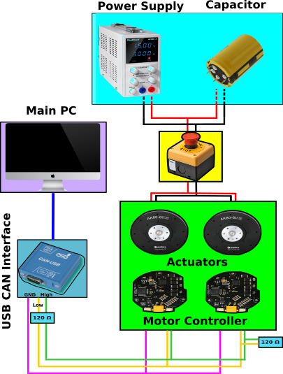

Hardware & Testbench Description
================================

The ``/hardware`` directory contains all information about the hardware
that is used to built the double pednulum test bench, including a bill
of materials, step files of the CAD model along with wiring diagrams for
the complete set up as well as the CAN bus. Further specifications are
noted below or can be found within the documentation under the
respective topics.

.. image:: ../../hardware/double_pendulum_CAD.png
   :width: 100%
   :align: center

Physical Parameters of the Actuator
-----------------------------------

The AK80-6 actuator from T-Motor is a quasi direct drive with a gear
ratio of :math:`\small{6:1}` and a peak torque of
:math:`\small{12\,Nm}` at the output shaft. The motor is equipped with
an absolute :math:`\small{12}` bit rotary encoder and an internal PD
torque control loop. The motor controller is basically the same as the
one used for MIT Mini-Cheetah, which is described in the documentation
from Ben Katz. - `Ben Katz: MIT Mini-Cheetah
Documentation <https://docs.google.com/document/d/1dzNVzblz6mqB3eZVEMyi2MtSngALHdgpTaDJIW_BpS4/edit>`__

.. image:: ../../hardware/motor_ak80-6.jpg
   :width: 100%
   :align: center

-  Voltage = :math:`\small{24\,V}`
-  Current = rated :math:`\small{12\,V}`, peak :math:`\small{24\,V}`
-  Torque = rated :math:`\small{6\,Nm}` , peak
   :math:`\small{12\,Nm}` (after the transmission)
-  Transmission :math:`\small{N = 6 : 1}`
-  Weight = :math:`\small{485\,g}`
-  Dimensions = :math:`\small{⌀\,\,98\,mm\times\,38.5\,mm}`.

-  Max. torque to weight ratio = :math:`\small{24\,\frac{Nm}{Kg}}`
   (after the transmission)
-  Max. velocity = :math:`\small{38.2\,\frac{rad}{s}}` =
   :math:`\small{365\,rpm}` (after the transmission)
-  Backlash (accuracy) = :math:`\small{0.15°(degrees)}`

Motor Constants
---------------

(before the transmission)

-  Motor constant :math:`\small{k_m = 0.2206 \,\frac{Nm}{\sqrt{W}}}`
-  Electric constant :math:`\small{k_e = 0.009524 \,\frac{V}{rpm}}`
-  Torque constant :math:`\small{k_t = 0.091 \,\frac{Nm}{A}}`
-  Torque = rated :math:`\small{1.092\,Nm}`, peak
   :math:`\small{2.184\,Nm}`
-  Velocity / back-EMF constant
   :math:`\small{k_v = 100 \,\frac{rpm}{V}}`
-  Max. velocity at :math:`\small{24\,V}`\ =
   :math:`\small{251.2 \,\frac{rad}{s}}` =
   :math:`\small{2400 \,\,rpm}`
-  Motor wiring in :math:`\small{\nabla- configuration}`
-  Number of pole pairs = :math:`\small{21}`
-  Resistance phase to phase = :math:`\small{170\pm5\,m\Omega}`
-  Inductance phase to phase = :math:`\small{57\pm10\,m\mu H}`
-  Rotor inertia :math:`\small{Ir = 0.000060719\,Kg.m^2}`

Electrical Setup
----------------

**Note:** We do not give any safety warranties on the electrical wiring.
All experiments and reproductions of our test bed are at your own risk.

The wiring diagram below shows how the double pendulum testbench is set
up. A main PC is connected to a motor controller board
(**CubeMars\_AK\_V1.1**) mounted on the actuator (**AK80-6 from
T-Motor**). The communication takes place on a CAN bus with a maximum
signal frequency of 1Mbit/sec with the 'classical' CAN protocol.
Furthermore, a USB to CAN interface is needed, if the main pc doesn't
have a PCI CAN card. Two different devices are used in our setup: the
**R-LINK module** from T-Motor and the **PCAN-USB adapter from PEAK
systems**. The former has CAN and UART connectors at the output, but
only works with Windows. The latter only features CAN connection, but
also works with Linux. The UART connector of the R-LINK module is
usefull to configure and calibrate the AK80-6.

The actuator requires an input voltage of :math:`\small{24\,V}` and
consumes up to :math:`\small{24\,A}` under full load. A power
supply that is able to deliver both and which is used in our test setup
is the **EA-PS 9032-40** from Elektro-Automatik. A capacitor filters the
backEMF coming from the actuator and therefore protects the power supply
from high voltage peaks. This wouldn't be necessary if the actuator is
powered from a battery pack, as in this case backEMF simply recharges
the batteries. The capacitor we use is made of **10x single 2.7V-400 F
capacitor cells** connected in series resulting a total capacity of
:math:`\small{40\,F}` and is wired in parallel to the motor. A
emergency stop button serves as additional safety measure. It
disconnects the actuator from power supply and capacitor, if only the
power supply gets diconnected the actuator will keep running with the
energy stored in the capacitor.

**Fig. 1:** actuator = AK80-6, controller board = CubeMars\_AK\_V1.1,
power supply = EA-PS 9032-40, capacitor = 10x 2.7V-400F cells connected
in series, USB-CAN interfaces = R-LINK module and PCAN-USB adapter.

backEMF
-------

The reverse current resulting from switching motor speeds from high to
low is called backEMF (Electro Magnetic Force). When the motor speed
decreases the motor works as a generator, which converts mechanical
energy into electrical energy and hence the additional current needs
some path to flow. The energy recycled back into the input power supply
causes a voltage spike and potential risk. It is necessary to add enough
input capacitance to absorb this energy. A sufficiently large input
capacitance is important in the desgin of the electric curcuit. It is
beneficial to have more bulk capacitance, but the disadvantages are
increased cost and physical size.

If the power source were a perfect battery, then energy would flow back
into the battery and be recycled. However, in our case the power source
is a DC power supply. Especially power supplies with an inverse-polarity
protection diode can only source current and cannot sink current, hence
the only place the energy can go is into the bulk capacitor. The amount
of energy stored in the bulk capacitor can be calculated with

.. math::

    \small{E = \frac{1}{2} \cdot C \cdot (V_{max}^2 - V_{nom}^2)},

where :math:`C` is the capacitance and :math:`V` is the voltage. In the case
of a Simple Pendulum max. backEMF can be estimated from the kinetic
energy of the pendulum

.. math::

    \newcommand{\vect}[1]{\boldsymbol{#1}}
    \newcommand{\dvect}[1]{\dot{\boldsymbol{#1}}}
    \newcommand{\ddvect}[1]{\ddot{\boldsymbol{#1}}}
    \newcommand{\mat}[1]{\boldsymbol{#1}}
    E_{kin} = \dot{\vect{q}}^T \mat{M} \dot{\vect{q}}

where :math:`M` is the mass matrix and :math:`\dot{vect{q}}` the
angular velocities of the joints. The voltage across the capacitor increases as
energy flows into it, so the capacitor should be sized accordingly to
the specific application requirements. Nevertheless tuning a capacitor
to the acceptable min. capacity is tricky, because it depends on many
factors including: 

- External load 
- Capacitance of the power supply to source current 
- Motor braking method, output short brake or current polarity reversing brake. 
- Amount of parasitic inductance between power supply and motor system, which
  limits the current change rate from the power supply. The larger the input
  capacitance, the more stable the motor voltage and higher current can be
  quickly supplied. 
- The maximum supply voltage limit and acceptable voltage ripples

If the used capacitor is too small for your specific apllication it
introduces the risk of burning the capacitor. The voltage rating for the
bulk capacitors should be higher than the typical operating voltage and
provide some safty margin. In our case we supply the AK80-6 with
:math:`\small{24\,V}`, whereas the capacitor can take up to
:math:`\small{27\,V}`. Therefore we have :math:`\small{3\,V}`
buffer, combined with a large capacity of :math:`\small{40\,F}`, we
ensure that during voltage spikes the capacitor never gets fully
charged. If you don't want to buy a huge and expensive capacitor you may
instead use a **break resistor**, which normally is cheaper to purchase.
A guidance on this topic is provided
`here <https://community.simplefoc.com/t/external-brake-resistor/973>`__.
One drawback using brake resistors is that they quickly heat up, if the
motor frequently brakes and regenerates energy. Another option to
prevent the bus voltage from spiking too high are **resistive shunt
regulators**, e.g. like this one from
`polulu <https://www.pololu.com/product/3775>`__, but they can't
dissipate much power and high-power versions also get expensive.

Communication: CAN Bus wiring
-----------------------------

Along the CAN bus proper grounding and ideally, isolated ground is
required for improvement of the signal quality. Therefore, the common
shared ground for PC and motors is of great importance in CAN connection
communication. When daisy-chaining multiple actuators, one can use the
Ground form the R-Link connector of the motor, which is connected to the
negative power pin. This can share the common ground from the PC side
and power supply. At the very begining and end of the CAN chain, there
must be of the termination resistors of :math:`\small{120\,\Omega}`
between CAN-High and CAN-Low, which will be then connected to the
corresponding pins between drivers. These resistors aim to absorb the
signals and prevents the signals from being reflected at the wire ends.
The CAN protocol is differential, hence no additional ground reference
is needed. The diagram below displays the wiring of the CAN bus.

**Fig. 2:** main pc = CPU, CAN transceiver = CAN XCVR, actuator = AC
